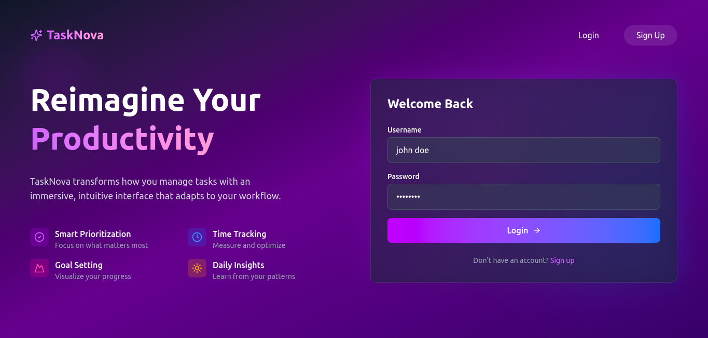
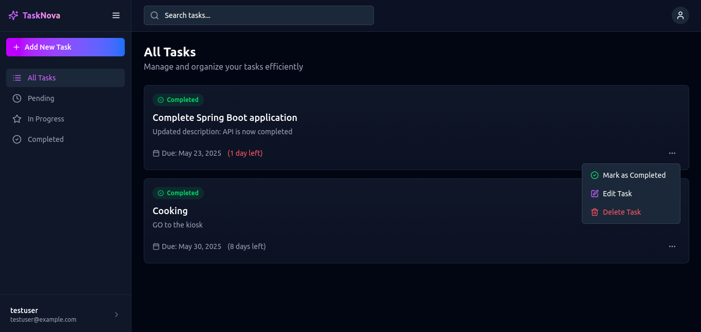
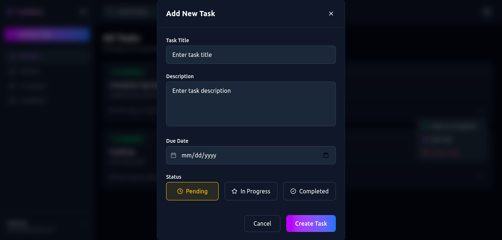
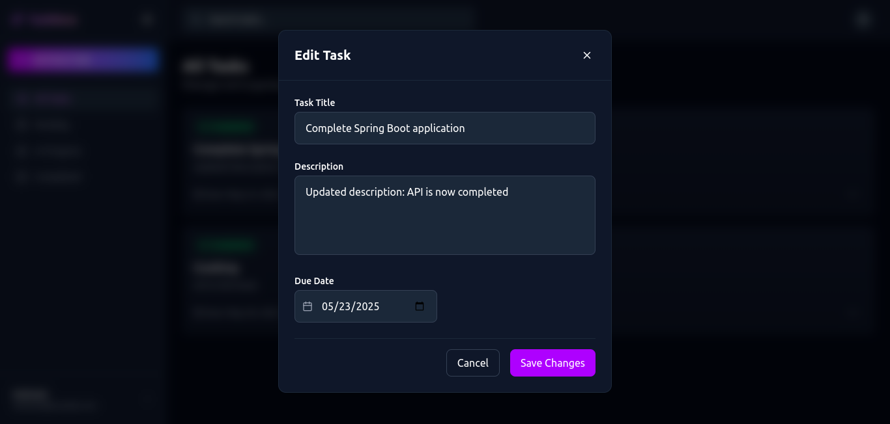
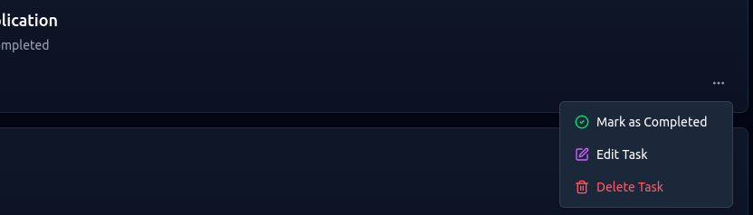

# 📝 Task Management Application

A full-stack Task Management Application that allows users to create, view, update, delete, and manage tasks efficiently. Built using **React.js** for the frontend and **Spring Boot** for the backend, with **PostgreSQL** as the database.

## 🚀 Features

### ✅ Core Functionalities
- Add, view, update, and delete tasks
- Mark tasks as Completed
- Filter tasks by status: Pending, In Progress, Completed
- Responsive UI using Tailwind CSS Lucid - React
- RESTful API backend with Spring Boot & PostgreSQL

### 🔄 Integration
- Frontend connects to backend using Axios
- Full error handling and HTTP status code compliance
- Clean user interface with form validations

### Unique Features Added
- User authentication with JWT/session
- Search tasks by title/description

---

## 🛠️ Tech Stack

| Frontend | Backend | Database |
|----------|---------|----------|
| React.js (with Context API / Redux) | Spring Boot | PostgreSQL |
| React Lucid | JPA / Hibernate | pgAdmin (for DB admin) |
| Tailwind CSS | Java | JDBC |
| Axios | Maven | - |

---

## 📁 Project Structure

```bash
task-manager/
├── backend/                    # Spring Boot application
│   └── src/
│       └── main/
│           └── java/
│               └── com/example/taskmanager/
│                   ├── controller/
│                   ├── model/
│                   ├── repository/
│                   └── service/
├── frontend/                   # React application
│   ├── public/
│   └── src/
│       ├── components/
│       ├── context/
│       ├── types/
│       ├── pages/
│       └── App.tsx
└── README.md
```


---

## 🔧 Setup Instructions

### 🧩 Prerequisites

- Java 17+
- Node.js 18+
- Maven
- PostgreSQL
- pgAdmin

---

### 1️⃣ Backend Setup (Spring Boot)

1. **Navigate to the backend folder**:
   ```bash
   cd backend

2. Set environment variables (in .env or application.properties):
```bash
spring.datasource.url=jdbc:postgresql://localhost:5432/tasks_db
spring.datasource.username=your_db_username
spring.datasource.password=your_db_password
spring.jpa.hibernate.ddl-auto=update

```
3. Create the PostgreSQL database
   ```bash
   CREATE DATABASE tasks_db;
   ```
4. Run the Spring Boot server:
   ```bash
   mvn spring-boot:run
   ```
   The backend should be running on http://localhost:8080

### 2️⃣ Frontend Setup (React.js)

1. Navigate to the frontend folder:
   ```bash
   cd frontend
   ```
2. Install dependencies:
   ```bash
   npm install
   ```
3. Start the development server:
   ```bash
   npm run dev
   ````
   The frontend will be available at http://localhost:5173

### 🔗 API Endpoints

| Method | Endpoint                  | Description              |
| ------ | ----------------------    | ------------------------ |
| GET    | `api/tasks`               | Get all tasks            |
| POST   | `api/tasks`               | Add a new task           |
| PUT    | `api/tasks/{id}`          | Update an existing task  |
| DELETE | `api/tasks/{id}`          | Delete a task            |
| PATCH  | `/api/{id}/complete`      | Mark a task as completed |

## 📸 Screenshots

### 🏠 Home Page


### 📊 Dashboard Page


### ➕ Add Task Page


### ✏️ Edit Task Page


### ❌ Delete Task



## 👨‍💻 Author
John Mwangi Muriithi
Software Engineer | JavaScript & Java Developer
